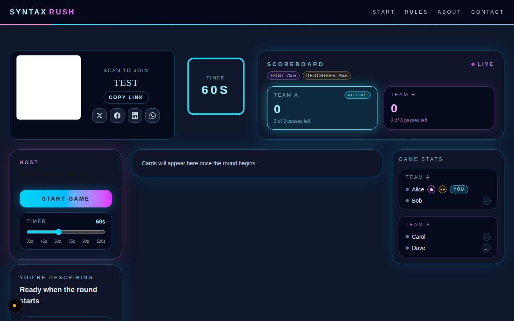
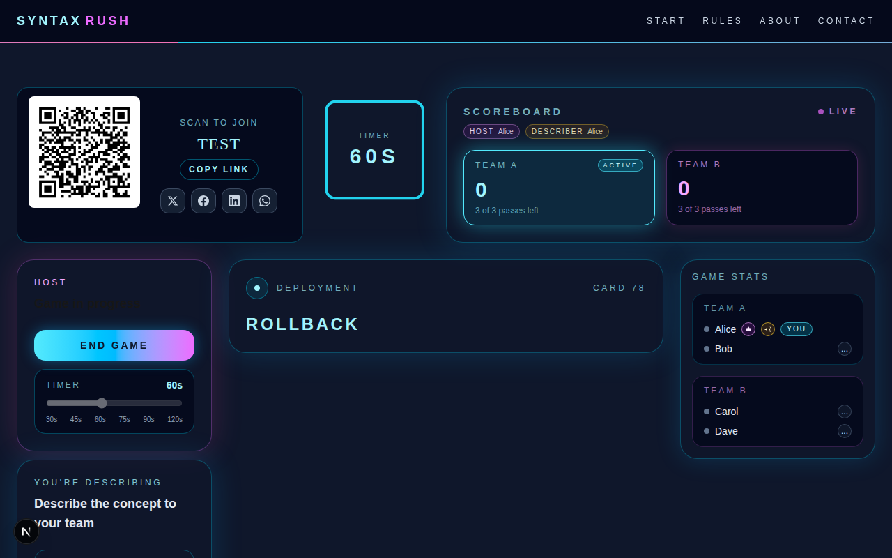
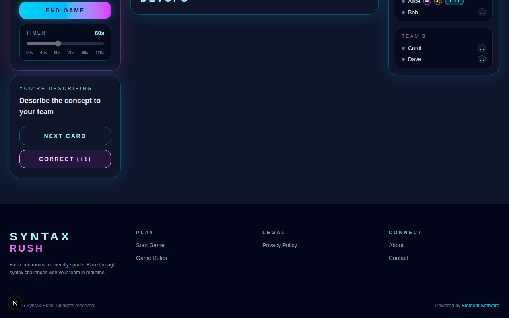
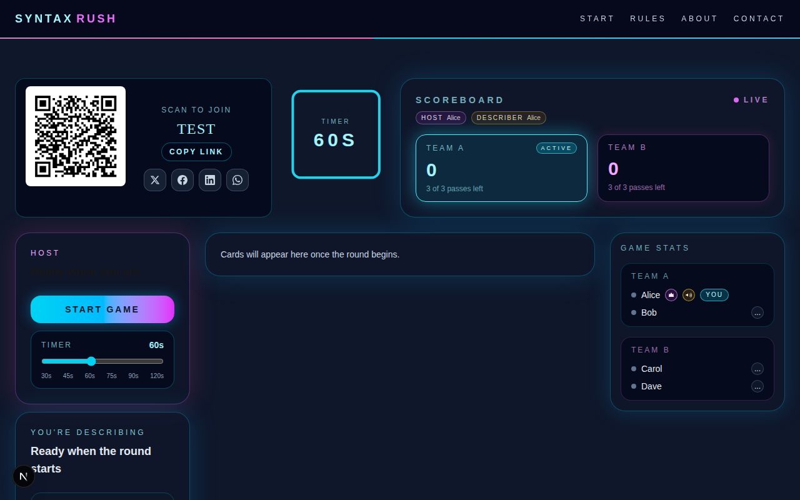
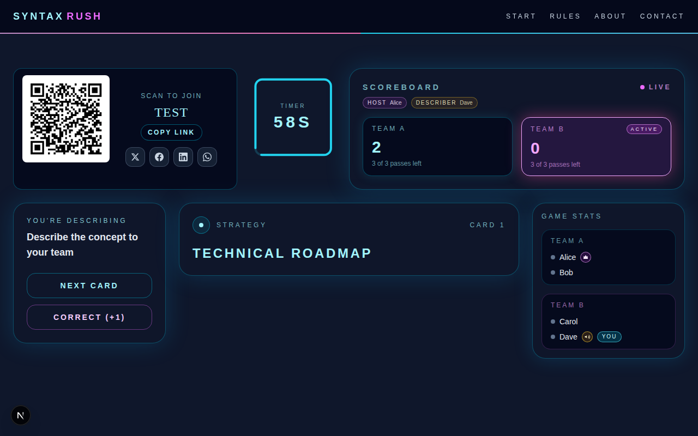
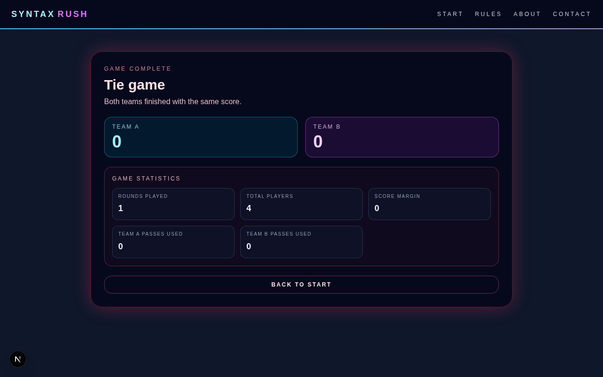

<div align="center">


# 🎬 E2E Application Demo Videos with Playwright

**Generate polished, shareable product walkthrough videos — fully automated.**

Combine [Playwright](https://playwright.dev/)'s scripted browser control with [ffmpeg](https://ffmpeg.org/)'s video rendering to produce an MP4 demo in a single command.

[](https://nodejs.org)
[](https://playwright.dev)
[](https://ffmpeg.org)
[](./LICENSE)
[](https://github.com/element-software/e2e-application-demo-videos-with-playwright/actions/workflows/demo-video.yml)

</div>

---

## ✨ What is this?

This repo ships a ready-to-run toolkit for **automatically recording application demo videos**:

- 🖥️ A real **Vite + React** demo app ("AppFlow") to tour
- 🤖 A **Playwright** script that drives the browser, captures screenshots at key moments, and records how long each slide should be displayed
- 🎞️ A **Node.js + ffmpeg** render pipeline that stitches those screenshots into a smooth, web-ready MP4
- ⚙️ A **GitHub Actions** workflow that runs the whole pipeline in CI and uploads the video as a downloadable artifact

One command. One video. Ready to share.

---

## 📸 Screenshots

> These are real screenshots captured automatically by the Playwright tour:

<table>
  <tr>
    <td align="center">
      <br>
      <sub><b>Game lobby — host view</b></sub>
    </td>
    <td align="center">
      <br>
      <sub><b>Round 1 — host describing</b></sub>
    </td>
  </tr>
  <tr>
    <td align="center">
      <br>
      <sub><b>Scoring a point</b></sub>
    </td>
    <td align="center">
      <br>
      <sub><b>Final scoreboard</b></sub>
    </td>
  </tr>
  <tr>
    <td align="center">
      <br>
      <sub><b>Round 2 — player view</b></sub>
    </td>
    <td align="center">
      <br>
      <sub><b>Game ended — host view</b></sub>
    </td>
  </tr>
</table>

---

## 🚀 Quick start

```bash
# 1. Clone & install
git clone https://github.com/element-software/e2e-application-demo-videos-with-playwright.git
cd e2e-application-demo-videos-with-playwright

npm install            # installs Playwright (root)
npm run app:install    # installs Vite + React deps

# 2. Install Playwright's Chromium browser
npx playwright install chromium

# 3. Generate the demo video  (requires ffmpeg on PATH — see Prerequisites)
npm run demo:video
```

> 🎉 The final MP4 will be written to **`demo/output/demo.mp4`**.

---

## 🛠️ Prerequisites

| Tool | Minimum version | Install |
|------|-----------------|---------|
|  | 18 | [nodejs.org](https://nodejs.org) |
|  | 4.x | `brew install ffmpeg` · `sudo apt install ffmpeg` · [ffmpeg.org](https://ffmpeg.org/download.html) |
|  | via Playwright | `npx playwright install chromium` |

> **Windows users:** make sure `ffmpeg.exe` is on your `PATH` (e.g. add it to
> System → Environment Variables after extracting the zip from ffmpeg.org).

---

## 📦 npm scripts

| Script | What it does |
|--------|--------------|
| `npm run demo:video` | 🎬 Full pipeline: capture + render |
| `npm run demo:video:capture` | 📷 Run Playwright tour → save PNGs + manifest |
| `npm run demo:video:render` | 🎞️ Read manifest → invoke ffmpeg → write MP4 |
| `npm run app:dev` | ⚡ Start the Vite dev server (port 5173) |
| `npm run app:build` | 🏗️ Compile the React app to `app/dist/` |
| `npm run app:preview` | 👁️ Serve the production build locally |

---

## 🗂️ Repository layout

```
.
├── app/                        # Vite + React demo application
│   ├── src/
│   │   ├── App.tsx             # Router / layout shell
│   │   ├── index.css           # Global styles (dark theme, CSS variables)
│   │   ├── components/
│   │   │   └── NavBar.tsx
│   │   └── pages/
│   │       ├── Home.tsx        # Hero / landing
│   │       ├── Features.tsx    # Feature grid
│   │       ├── Dashboard.tsx   # Metrics + bar chart
│   │       └── GetStarted.tsx  # Sign-up form
│   ├── index.html
│   ├── vite.config.ts
│   └── package.json
│
├── e2e/
│   ├── demo-video.spec.ts      # Playwright scripted tour (desktop)
│   ├── demo-video-mobile.spec.ts # Playwright scripted tour (mobile)
│   ├── game.spec.ts            # Multi-player game E2E tests
│   ├── fixtures/               # Shared test fixtures & helpers
│   └── screenshots/            # Committed example screenshots
│
├── scripts/
│   └── render-video.mjs        # Node.js ffmpeg invocation script
│
├── demo/                       # Generated at runtime (git-ignored)
│   ├── branding/               # Logo and audio assets
│   ├── slides/                 # PNGs written by Playwright
│   ├── output/                 # demo.mp4 written by render script
│   └── manifest.txt            # ffmpeg concat-demuxer manifest
│
├── .github/
│   └── workflows/
│       └── demo-video.yml      # CI workflow
│
├── demo.config.mjs             # Central config (fps, crf, audio, paths)
├── playwright.config.ts        # Playwright settings (viewport, webServer)
├── package.json                # Root scripts & devDependencies
├── LICENSE                     # MIT
└── README.md
```

---

## 🏗️ Architecture

```
┌──────────────┐     Playwright      ┌───────────────────┐
│  Vite + React│ ←── scripted tour ──│ demo-video.spec.ts│
│  dev server  │                     └─────────┬─────────┘
│  :5173       │                               │ screenshots
└──────────────┘                               ▼
                                      demo/slides/*.png
                                               │
                                               │ + durations
                                               ▼
                                      demo/manifest.txt
                                      (ffmpeg concat format)
                                               │
                                    render-video.mjs
                                               │ ffmpeg
                                               ▼
                                      demo/output/demo.mp4
```

### Step 1 — 📷 Capture (`demo:video:capture`)

`e2e/demo-video.spec.ts` runs in a Chromium browser at a fixed
**1280 × 720** viewport.  Each `captureSlide()` call:

1. Navigates to a route / triggers a UI state.
2. Waits for `networkidle` so animations and fetches are settled.
3. Saves a **PNG** to `demo/slides/NN-name.png`.
4. Records the slide's display duration (seconds).

After all slides are captured the test writes **`demo/manifest.txt`** in
[ffmpeg concat-demuxer](https://ffmpeg.org/ffmpeg-formats.html#concat-1) format:

```
file '/abs/path/01-home.png'
duration 3
file '/abs/path/02-features.png'
duration 4
...
file '/abs/path/last-slide.png'   ← repeated without duration (required quirk)
```

> **ffmpeg concat quirk:** the last `file` line must be repeated *without* a
> `duration` entry, otherwise ffmpeg discards the final frame entirely and the
> last slide has zero length in the output video.

### Step 2 — 🎞️ Render (`demo:video:render`)

`scripts/render-video.mjs` (pure Node.js, no extra dependencies):

1. Loads configuration from `demo.config.mjs`.
2. Parses `manifest.txt` and sums `duration` lines to get `totalDuration`.
3. Validates that `ffmpeg` is on PATH and all referenced files exist.
4. Calls `ffmpeg` with:

   ```
   ffmpeg \
     -f concat -safe 0 -i manifest.txt   \   # image sequence input
     [-i audio/background.mp3]            \   # optional audio input
     -vf fps=30,format=yuv420p            \   # normalise framerate + pixel fmt
     [-af atrim=0:<total>,afade=out:...]  \   # audio trim + fade-out
     -c:v libx264 -crf 22 -preset medium  \
     -movflags +faststart                 \   # web-optimised: moov atom first
     [-c:a aac -b:a 192k -shortest]       \
     -y demo/output/demo.mp4
   ```

---

## ⚙️ Configuration (`demo.config.mjs`)

```js
const config = {
  slidesDir:         'demo/slides',       // where Playwright writes PNGs
  manifestPath:      'demo/manifest.txt', // ffmpeg manifest
  outputPath:        'demo/output/demo.mp4',
  fps:               30,
  crf:               22,                  // 18 = near-lossless, 28 = smaller

  // Optional background audio
  audioPath:         null,                // e.g. 'audio/background.mp3'
  audioFadeDuration: 2,                   // seconds of fade-out at end
};
```

### 🎵 Adding background music

1. Obtain a royalty-free MP3 (e.g. from [Pixabay Music](https://pixabay.com/music/),
   [freemusicarchive.org](https://freemusicarchive.org/), or generate a silent
   placeholder with
   `ffmpeg -f lavfi -i "anullsrc=r=44100:cl=stereo" -t 60 audio/placeholder.mp3`).
2. Place it at e.g. `audio/background.mp3`.
3. Set `audioPath: 'audio/background.mp3'` in `demo.config.mjs`.

> The `audio/` directory is listed in `.gitignore`.  Do **not** commit
> copyrighted audio files.

---

## 🎨 Customising the demo tour

Edit **`e2e/demo-video.spec.ts`**.  Each slide is defined with:

```ts
await captureSlide(
  '03-dashboard',   // slide file name (determines sort order)
  4,                // display duration in seconds
  async () => {
    await page.click('a[href="/dashboard"]');
    await page.waitForSelector('[data-testid="page-dashboard"]');
  }
);
```

Adjust slide durations, add new slides, or change the viewport in
`playwright.config.ts`.

---

## 🤖 GitHub Actions

The workflow at `.github/workflows/demo-video.yml` triggers on:

- Manual dispatch (Actions tab → **"Run workflow"**)
- Pushes to `main` that touch the app, tests, scripts, or config

It installs ffmpeg, runs the full pipeline, and uploads `demo.mp4` as a
downloadable workflow artifact (retained 30 days).

---

## 🔧 Troubleshooting

<details>
<summary><b>❌ <code>ffmpeg: command not found</code></b></summary>

Install ffmpeg and ensure it is on your `PATH`.  Verify with `ffmpeg -version`.

</details>

<details>
<summary><b>⏱️ Last slide is too short / missing in the output video</b></summary>

The concat manifest must end with a bare `file 'last.png'` line (no `duration`).
The `writeManifest` helper in `demo-video.spec.ts` handles this automatically.

</details>

<details>
<summary><b>🖼️ Black frames or wrong aspect ratio</b></summary>

Make sure the Playwright viewport and all screenshots share the same width/height.
The default `1280 × 720` is set in `playwright.config.ts` → `use.viewport`.

</details>

<details>
<summary><b>📂 <code>ENOENT: no such file or directory … manifest.txt</code></b></summary>

Run `npm run demo:video:capture` before `npm run demo:video:render`, or use the
combined `npm run demo:video` script.

</details>

<details>
<summary><b>🌐 Playwright can't reach the dev server</b></summary>

If `webServer` times out, start the dev server manually in a separate terminal
(`npm run app:dev`) then re-run with:

```bash
DEMO_BASE_URL=http://localhost:5173 npm run demo:video:capture
```

</details>

---

## 🛡️ Tech stack

<div align="center">

[](https://playwright.dev)
[](https://react.dev)
[](https://vitejs.dev)
[](https://www.typescriptlang.org)
[](https://ffmpeg.org)
[](https://nodejs.org)
[](https://github.com/features/actions)

</div>

---

## 📄 License

[MIT](./LICENSE) © element-software
